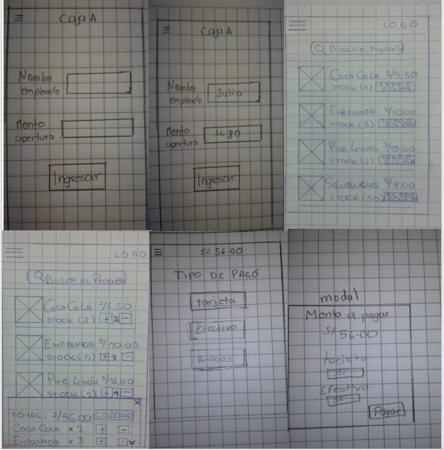
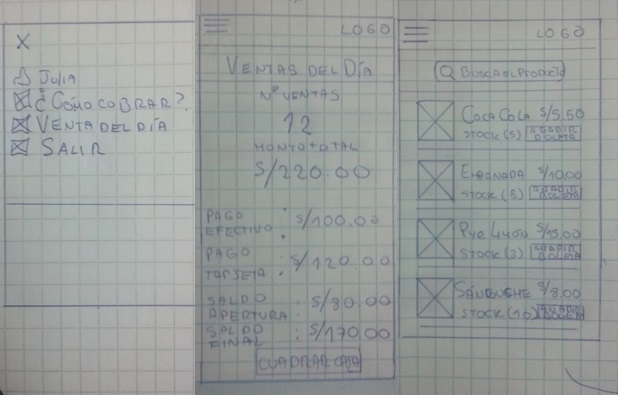
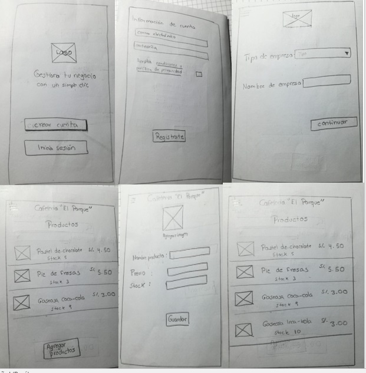

# Reto

Se tiene que  replicar la app de Square POS.

# Contexto

Este producto digital   consiste en   crear una app parecida a Square POS pero adaptada a las necesidades de nuestro país en términos de flujos, monedas e impuestos. La aplicación móvil debe  permitir personalizar los productos con fotografías,nombres, precios gestionar artículos y empleados.

Esta aplicación es probada en la cafeteria "El parque", la cual sera  usada  para agregar sus productos, colocar la cantidad de cada producto, cargar una  imagen y  colocar un precio del mismo; estas tareas estan contempladas dentro del rol del administrador. Por otro lado el rol del empleado, permite seleccionar los productos que se consumió ya sea uno solo o varios, cobrar y generar reporte de venta del día.

## Objetivos de la aplicación

* Catálogo de productos con precios y stocks.

* Cobros en efectivo y tarjeta de crédito.

* Cuadre de caja al final del día.

# Idea de Negocio

Se creó  la aplicación móvil de nombre "Venta rápida" , la cual es  fácil de usar y ayuda a administrar cualquier tipo de negocio. Permite tener dos roles uno para el administrador del negocio y otra para los empleados, con diferentes funcionalidades en ambos roles.

## Benchmarck

  Se toma como  referencias a otros institutos que ya cuentan con matrícula, inscripcion y pago online.

   

### Conclusiones Benchmarking

# Síntesis y definición

## Affinity map

## User person

## User flow

# Ideación

## Feature List

# Prototyping

## Prototipo en papel

Se testeó a 2 usarios, tomamos en cuenta sus observaciones para realizar un mejor prototipo digital

Flujo de empleado

Flujo de administrador

  * Conclusiones

## Prototipo alta fidelidad

  Se logro testear a 1 alumno, nod dio importantes observaciones.

  https://marvelapp.com/872eh67

  * Conclusiones

